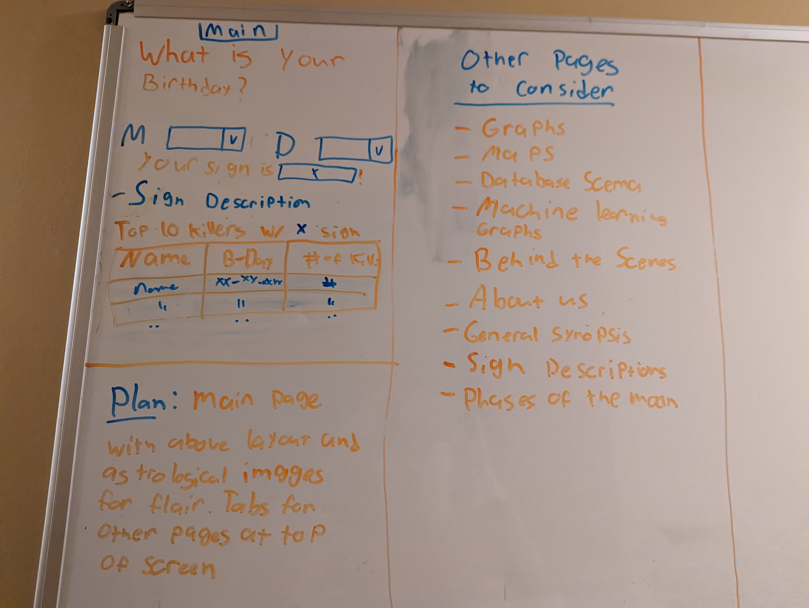

# Horrorscopes

# <b>SEGMENT 1 README</b>

We selected the topic of "Horrorscopes: Does Astrological Season or Sign Have Any Effect on Crime?" This topic was selected as many share a fascination with crimes and the reasons why they are committed. In addition, many have a deep interest in astrology and the hypothesis that the stars and planets may have an effect on how we lead our lives. We want to explore whether or not there could be any possible connection between these two fascinations, or if it is a case of correlation =/= causation.

Website: https://rulamia.github.io/Horrorscopes/

# Github Repository and Project Overview
## Outline of Project
 

### Data Sets
  - KCPD Crime Data Set: A data set from 2009 containing every crime recorded in Kansas City, Missouri during that year. It distinguishes on type of crime and the time and date the crime was committed. This data set has over 100,000 rows.
  - Texas Death Row Data Set: A dataset depicting the name, date of birth, and type of crime committed by Texas Death Row inmates. This is our smallest data set, coming in at just over 200 rows.
  - Wikipedia Serial Killer Data Set: a data set directly scraped from Wikipedia containing the name and data birth of many famous serial killers.
  
### Question We Hope to Answer
  - Does crime happen more during certain astrological seasons?
  - Is there a particular zodiac sign that is more likely to be a murderer?
  - Are pisces men the worst?

# Group 2 Communication Protocol
## Participants
* Angelique Walker
* Corrine Moore
* Darcy Barnett
* Jessica Stearns
* Lauren Debes

## Methodology
* Slack
* Zoom
* Google Documents

## Summary
Group 2 has committed to meeting multiple times a week on Zoom outside of designated class time to collaborate and delegate specific tasks amongst our group members. When not in a meeting, we communicate via Slack to update each other on the status of our specific tasks as well as coordinate schedules. While meeting, we make contributions to a shared Google Document that keeps a running log of each meeting, what is discussed, what is delegated, and what has yet to be delegated. This document is also referenced outside of class to remind each group member of what everyone should be working on.

Group 2 is dedicated to maintaining professionalism and upholding a deep respect for every other group member's time, input, and experience.

## Segment One: Database Mock Up
### Overview: Analyzing crime and the Zodiac
Can Kansas City crime data filtered by date and Zodiac season tell us which season is the most criminal?
Based on Texas death row data, which sign is the most dangerous?

### Technology
 - Jupyter Notebook
 - PostgreSQL
 - Amazon Web Services

For the purposes of our research we are using Jupyter Notebook to preprocess our data and convert it into csv files. The prepared data will be hosted on an AWS database 
instance and accessed locally using a PostgreSQL database.

### Schema and ERD
There are currently four tables anticipated for our presentation: 
 - KC crime data 2009
 - Zodiac moon chart 2009
 - Texas death row birthdays
 - Sign Date Ranges
 
 The KC crime data will be filtered for the zodiac season using the Zodiac moon chart. Texas death row birthdays will be matched to the Sign Date Ranges table.
 
 
 
 ### Status 8/16/22
 The AWS host is created, team is connected, local database is ready for table build testing.

  ##### End Segment One.

  # <b>Segement Two: Database Testing and Importing of Data</b>
  ### Creating Tables
  Tables for our incoming data are built in this phase of the work. 
   - Killers test
   - KC crime data 2009
   - Zodiac moon chart 2009
   - Serial killer Zodiac chart
   - Sign date ranges

The table killers test is just what it sounds like, originally it was intended to be used solely to test the connection string and database hosting verification. It did help verify hosting but the connection string was another matter. This will be discussed further in the rest of this section. This was one of the hurdles we faced in segment 2. We had mistakenly built our database in the wrong location on the server. This also led to using the wrong address within the connection string.

The tables above are slightly different from the original ERD and are the result of manipulation and cleaning practices. As different aspects of the data were explored, it seemed that it could be narrowed down a bit more. As data conversions were attempted to match the database, some other issues surface. Some data wasn't uniform. As a result the data would not convert into the desired data type. This means data that was thought to be cleaned actually wasn't, partially because the planning phase had not been thorough enough to flush out these potential issues.

As mentioned earlier in this section, the testing table, killers_test had served the purpose of verifying that the database was functioning. However, the connection string had failed. We had mistakenly built the database in the wrong location in our within our database server. This also led to using the wrong address when constructing the connection string.

I had planned for another version of the moon chart table with a Boolean column for “Full_Moon” in place of the “Moon_Type” column currently used. I will try to upload this updated table or perhaps include it in the code for the machine model.

This segment has highlighted the potential problems of that can be born in the planning phase of an ETL. Had the final cleaned data been planned out more thoroughly, the database could have been constructed more easily. As it stands the database should be functional and complete within the next two days. Although this is slightly behind schedule, it doesn't appear to affect the finished project.
  The tables above are slightly different from the original ERD and are the result of manipulation and cleaning practices. As I looked at different aspects of the       data, it seemed that it could be narrowed down a bit more and other edits needed to be done such as data conversions. This caused a challenge, as some of the data     that was thought to be cleaned had to be redressed and I hadn’t been sure of the conversions until I verified with my team.

  
  ### New ERD
  
  

## Preliminary Data Preprocessing

### KC Crime Data

For a successful linear regression model to determine if there is any correlation, careful preprocessing will need to take place. Our dependent variable, Description of the type of crime committed, will need to transformed from categorical data to numerical data. To make this possible, one-hot encoding will be utilized to transform the features into a dummy set. This dataset is quite large, and the Description feature contains several different types of crimes committed. To run a smooth linear regression, the types of crime will be bucketed into smaller categories, including an “other” category for the least common occurrences. 

Any missing data will need to be addressed as well. The scikit learn imputer will be used to transform any null values into the mean value. Date values will need to be cleaned up and in a consistent format for the machine to read them.

### Serial Killer Data

After further analyzing the decided upon datasets, we made the decision to drop the Texas Death Row csv. Instead, we scraped wikipedia for Serial Killer data. This is more relevant to our initial questions “Is there a particular zodiac sign that is more likely to be a murderer?” And “Are Pisces men the worst?” Clustering will still be the appropriate model for machine learning, but it was decided kNN (k Nearest Neighbors) Clustering will be more appropriate. 

K Nearest Neighbors is a supervised learning algorithm used for classification. This model will group the serial killers together by zodiac sign and kill count to determine if our hypothesis is correct. The most important features of this dataset are the date of birth and kill count. Irrelevant columns will be dropped. Buckets separating the dates of birth within the range of each astrological sign will need to be created. Like the KC Crime Data, we will need to clean up the date formats before bucketing.

## Provisional Machine Learning Models

At this time in the analysis, we have committed to a Kansas City Crime dataset with over 300,000 rows and a Texas Death Row dataset, specifically a CSV that includes the dates of birth with 238 rows. Ideally, we will be using Machine Learning to answer the following questions:
  - Does crime happen more during certain astrological seasons?
  - Is there a particular zodiac sign that is more likely to be a murderer?
  - Are pisces men the worst?
  
 ### Using Linear Regression to answer, "Does crime happen more during certain astrological seasons?"
 
The dataset that contains the information we need to answer this question is the Kansas City Crime Data resource. I took a quick look at the data in Pandas to determine which columns contain the information for this problem that can be plugged into an appropriate machine learning model.
 

It is determined the Description and From Date columns hold the most relevant information to answer our question. Due to Description being a target, or dependent variable, I have concluded a Linear Regression model can be used to answer this question. To make this work effectively, the Description data will need to be transformed into numerical classifcations. With 136 unique possibilities under Description, bucketing the descriptions that are least present in the data into an "other category" will need to be done for efficiency.

### Using Decision Trees and Clustering to answer, "Is there a particular zodiac sign that is more likely to be a murderer?" and cheekily, "Are pisces men the worst?"

The Texas Death Row dataset contains a csv file that features a date of birth column. This is important to classify the data by each Astrological House's timeframe. 

Utilizing the Decision Tree Classifier can group together data with similar attributes; i.e. the dates of birth that fall into each sign's date range.

## Testing and Training

### KC Crime Data and Serial Killer Data

Because the KC Crime Dataset contains over 100,000 rows of information, the testing and training will begin with the standard 70% training and testing method. This will be altered throughout the process if needed, but will not be overdone as to skew the results.

I will also begin with the 70/30 training and testing on the Serial Killer Data. Even though this dataset is significantly smaller, this is a popular start for training and testing the data. As we grow more familiar with the data during this process, this plan may change.

## Model Choices, limitations, and benefits

### KC Crime Data

A linear regression model was chosen for this dataset because we are trying to answer a question asking how strong the relationship between two variables is. 

#### Benefits

Linear Regression is a simple model. It is easier to communicate how the model will work and interpret the results. To avoid overfitting, the model can be regularized. New data can be plugged in easily if more questions come up in the analysis.

#### Limitations

Even though the model can be regularized to avoid overfitting, linear regression models are prone to overfitting. With such a large dataset, there is a possibility of outliers that will skew the data.

### Serial Killer Data

The kNN model was chosen for the Serial Killer Data because it is also simple to understand classification model, which will be needed to group the zodiac signs and kill counts.

#### Benefits

As mentioned above, these models are simple and easy to understand. There are no assumptions of the data like a linear regression model would have. This model is ever evolving and adjustable to multi-class problems.

#### Limitations

As great as the kNN is for the questions we are asking, this model can be slow running. Finding the optimal number of neighbors can be challenging. If any data is imbalanced, the model will not perform well. Like linear regression, this algorithm is sensitive to outliers.

### Summary

While confident our questions can be answered using Linear Regression and Decision Trees, I am not confident the Texas Death Row data has enough information to gather the results we are looking for with only 238 lines. I believe a larger dataset with more data will be needed.

## Website Creation

#### Website Whiteboard

We are using a website to meet the dashboard criteria. The main page of the website has been completed for the week 2 deliverable. The drawn out plan for the website can be seen above as a whiteboarded mock up. The finished website will have multiple tabs to show off the project. The tabs will be as follows: 
- Graphs (included maps)
- Machine Learning (The graphs created from the machine learning)
- About us (The readme and a little bit about each team member)
- Info (Descriptions of each star sign and phases of the moon)

## Dashboard
### Description of Tools
For the dashboard (the website) we plan to utilize the following tools:
- CSS
- HTML
- Javascript
- Tableau

### Description of interactive element(s)
Users will be able to enter their date of birth and the star sign will be returned along with a list of the top 10 most prolific serial killers with the same sign.

### Google Slides
Link to google slides https://docs.google.com/presentation/d/1n4ICouEj4aP_hmIUv2Y82vsaKj3_vamR2qQDVS9gTEQ/edit?usp=sharing

main
