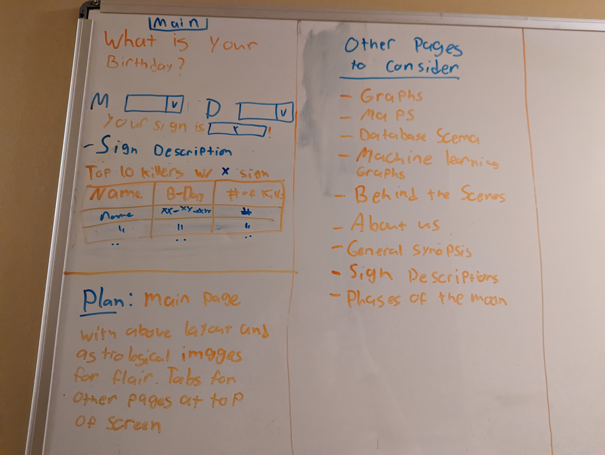

# Horrorscopes

## Overview

We selected the topic of "Horrorscopes: Does Astrological Season or Sign Have Any Effect on Crime?" This topic was selected as many share a fascination with crimes and the reasons why they are committed. In addition, many have a deep interest in astrology and the hypothesis that the stars and planets may have an effect on how we lead our lives. We want to explore whether or not there could be any possible connection between these two fascinations, or if it is a case of correlation =/= causation.

Website/Dashboard: https://rulamia.github.io/Horrorscopes/

### Outline of Project

 

### Data Sets

- KCPD Crime Data Set: A data set from 2009 containing every crime recorded in Kansas City, Missouri during that year. It distinguishes on type of crime and the time and date the crime was committed. This data set has over 100,000 rows.

- Wikipedia Serial Killer Data Set: a data set directly scraped from Wikipedia containing the name and data birth of many famous serial killers.

### Questions We Hope to Answer

- Does crime happen more during certain astrological seasons?
- Is there a particular zodiac sign that is more likely to be a murderer?
- Are pisces men the worst?

### Techonology Utilized

- Adobe Illustrator
- Bootstrap
- CSS
- Excel
- Google Colab
- HTML
- Javascript
- Mito
- Pandas
- Postgres
- Python
- SQL
- Tableau
- sklearn
- matplotlib
- LabelEncoder
- OneHotEncoder

## Results

### Database

For the purposes of our research we are using Jupyter Notebook to preprocess our data and convert it into csv files. The prepared data will be hosted on an AWS database 
instance and accessed locally using a PostgreSQL database.

#### Schema and ERD
There are currently four tables anticipated for our presentation:  
- KC crime data 2009
- Zodiac moon chart 2009
- Sign Date Ranges
 
The KC crime data will be filtered for the zodiac season using the Zodiac moon chart. Texas death row birthdays will be matched to the Sign Date Ranges table.
 

#### Status 8/16/22

The AWS host is created, team is connected, local database is ready for table build testing.

#### Creating Tables
  Tables for our incoming data are built in this phase of the work. 
   - Killers test
   - KC crime data 2009
   - Zodiac moon chart 2009
   - Serial killer Zodiac chart
   - Sign date ranges

The table killers test is just what it sounds like, originally it was intended to be used solely to test the connection string and database hosting verification. It did help verify hosting but the connection string was another matter. This will be discussed further in the rest of this section. This was one of the hurdles we faced in segment 2. We had mistakenly built our database in the wrong location on the server. This also led to using the wrong address within the connection string.

The tables above are slightly different from the original ERD and are the result of manipulation and cleaning practices. As different aspects of the data were explored, it seemed that it could be narrowed down a bit more. As data conversions were attempted to match the database, some other issues surface. Some data wasn't uniform. As a result the data would not convert into the desired data type. This means data that was thought to be cleaned actually wasn't, partially because the planning phase had not been thorough enough to flush out these potential issues.

As mentioned earlier in this section, the testing table, killers_test had served the purpose of verifying that the database was functioning. However, the connection string had failed. We had mistakenly built the database in the wrong location in our within our database server. This also led to using the wrong address when constructing the connection string.

I had planned for another version of the moon chart table with a Boolean column for “Full_Moon” in place of the “Moon_Type” column currently used. I will try to upload this updated table or perhaps include it in the code for the machine model.

This segment has highlighted the potential problems of that can be born in the planning phase of an ETL. Had the final cleaned data been planned out more thoroughly, the database could have been constructed more easily. As it stands the database should be functional and complete within the next two days. Although this is slightly behind schedule, it doesn't appear to affect the finished project.
  The tables above are slightly different from the original ERD and are the result of manipulation and cleaning practices. As I looked at different aspects of the       data, it seemed that it could be narrowed down a bit more and other edits needed to be done such as data conversions. This caused a challenge, as some of the data     that was thought to be cleaned had to be redressed and I hadn’t been sure of the conversions until I verified with my team.

#### New ERD
 

#### Status 09/04/2022:

We were able to do an inner join between the Full_Moon_2009 Table and the KC Crime Data Table after fixing the date column formatting for both tables and converting the data type to datetime.
All deliverables for Segment 2 are now met.

### Machine Learning

The questions for our analysis "Does crime happen more during certain astrological seasons?" and "Is there a particular zodiac sign that is more likely to be a murderer?" ultimately became the subjects for the machine learning process.

To answer the question of whether or not crime happens more during astrological seasons, the KC Crime Data table from our database was used to compare the zodiac signs to three categories of crime: misconduct, theft, and violent.

To find out if there is a zodiac sign more likely to be a murder, the kill counts vs zodiac signs were modeled.

#### Data Preprocessing, Feature Engineering and Feature Selection

KC Crime Data Logistic Regression: The first step in the data preprocessing was to examine the data pulled from the "full_moon_vs_crime_date" table from our database. It was determined there were 4,152 object types in the "Sign" and "Crime_Type" columns, the chosen features for the machine learning process. "Signs" was chosen to act as the target variable, and "Crime_Type" the independent variable. Deeming the "Crime_Moon_Type column unnecessary for this model, the next step taken was to drop that column, leaving two columns with rows containing objects. The "Sign" column was encoded using LabelEncoder, which changed the object of each row into a number from 0 to 11. The "Crime_Type" columns was encoded using OneHotEncoder. A new DataFrame was created with three new columns for the OneHotEncode crime types, and the "Crime_Type" column was dropped. I then renamed the three new columns based on their crime types: Misconduct, Theft, and Violent. I then created visuals using Seaborn, a data visualization library based on matplotlib.

The first chart shows a distribution of the target variable, "Sign."

The second chart visualizes the relationship between "Sign" and "Misconduct."

The third chart visualizes the relationship between "Sign" and "Theft."

The fourth chart visualizes the relationship between "Sign" and "Violent."

Killers Logistic Regression: The data preprocessing, feature engineering, and feature selection was much similar on this dataset as the KC Crime Data due to Logistic Regression also being performed on this data. The target variable is again the Zodiac Sign, which was encoded for the model using LabelEncoder. The independent variable, "proven_victims," was already in numerical form. Seaborn was used again to attractively visualize the distribution of the target variable and the relationship between this variable and the "proven_vistims."

The first chart shows a distribution of the target variable renamed during the encoding process as "Signs_N."

The second chart visualizes the relationship between "Signs_N" and "proven_victims."

#### Training and Testing sets

The training and testing sets for both the KC Crime Data and Killers datasets was a standard 80% training set and 20% testing set. 

#### Model Choices

Due to the presence of categorical data and the desire for simplicity, I chose logistic regression models for both Datasets.

Limitations: Both datasets are limited using the Logistic Regression due to the model's lack of the ability to obtain complex relationships between the target and independent variables. Both datasets may have benefited from clustering models, like originally planned, instead of trying to force the data into a linear decision because it is a simpler model.

Benefits: Logistic Regression was chosen for both datasets because it was thought to have been easier to implement, interpret, and efficient to train. It also would, and may still be, simple to plug in additional tables created during the DataBase phase of this analysis.

Changes in model choice: A K Nearest Neighbors model was originally planned for the Serial Killer Dataset. For efficiency purposes, this was changed to Logistic Regression. Linear Regression was originally and incorrectly chosen for the KC Crime Dataset. After realizing the error in choosing Linear Regression for categorical data, it was altered to Logistic Regression.

#### Current Accuracy Score

The accuracy scores for both models are very, very low. The KC Crime Data Logistic Regression's score is a disappointing 9%. Even worse, the Killers Logistic Regression is only 7%.

KC Crime Data Logistic Regession Accuracy Score:

Killers Crime Data Logistic Regression Accuracy Score:

I believe the decision to use Logistic Regression with the features chosen from each dataset was wrong. Clustering my also produce results that show no correlation between the data and our questions, but I believe they would be a more realistic test for the data.

### Dashboard

We are using a website to meet the dashboard criteria. The main page of the website has been completed for the week 2 segment. The drawn out plan for the website can be seen above as a whiteboarded mock up. The finished website will have multiple tabs to show off the project. The tabs will be as follows: 
- Machine Learning (The graphs created from the machine learning)
- About us (The readme and a little bit about each team member)
- Info (Descriptions of each star sign and phases of the moon)

#### Description of Interactive Element

Users will be able to enter their date of birth and the star sign will be returned along with a list of the top 10 most prolific serial killers with the same sign.

### Presentation

The link to our Google Slides presentation can be found below.

https://docs.google.com/presentation/d/1n4ICouEj4aP_hmIUv2Y82vsaKj3_vamR2qQDVS9gTEQ/edit#slide=id.p

## Summary

To be completed upon completion of ML Models.
